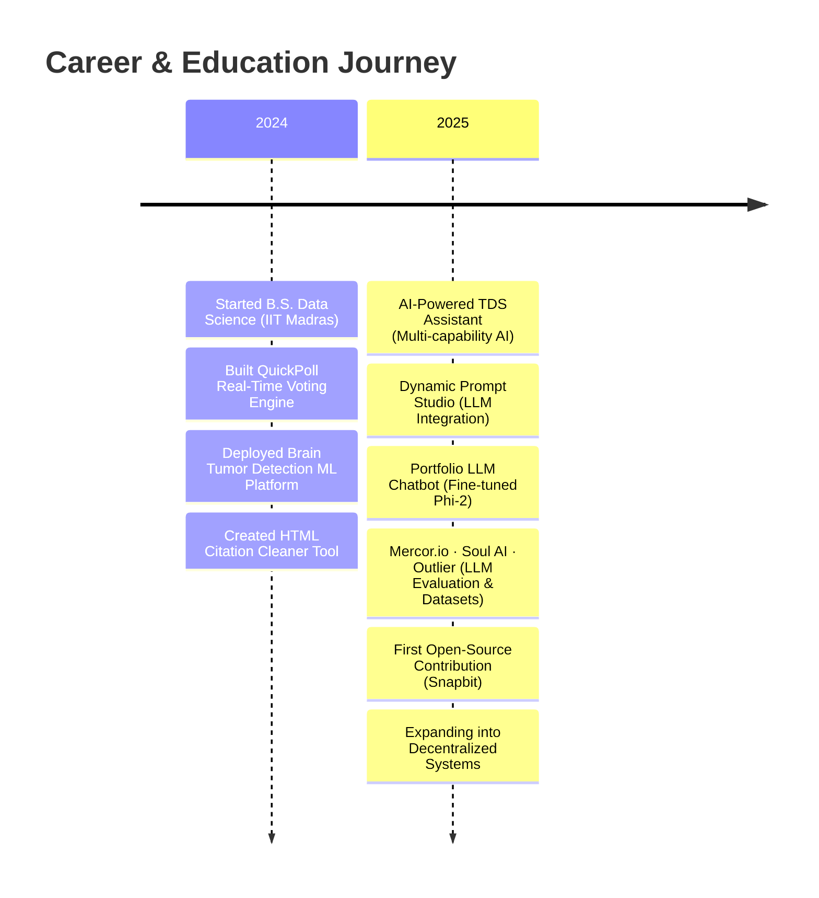

<div align="center">
  
# 👨‍💻 Vicky Kumar

### AI Engineer · Full-Stack Developer · Open-Source Builder

[](https://www.linkedin.com/in/algsoch)
[](https://github.com/algsoch)
[](https://www.kaggle.com/algsoch)
[](mailto:npdimagine@gmail.com)

**Building reliable, scalable, and production-ready systems across AI, backend engineering, and real-time applications.**

</div>

---

## 🧭 About Me

I'm an **AI Engineer** and **Full-Stack Developer** passionate about building real-world systems that combine:
- 🤖 Deep learning and LLM integration
- 🏗️ Scalable backend architecture
- ⚡ High-performance real-time applications
- 🔧 Production-grade engineering practices

My work spans **LLM evaluation**, **dataset creation**, **real-time communication engines**, **full-stack ML deployment**, and **open-source tooling**. I focus on **clarity**, **performance**, and **production reliability**—shipping software that withstands real-world usage, not just demos.

🎓 **Currently:** Pursuing B.S. in Data Science at **IIT Madras**  
🚀 **Expanding into:** Distributed systems, decentralized tech, and high-performance infrastructure

---

## 🛠️ Tech Stack & Engineering Strengths

<table>
<tr>
<td valign="top" width="33%">

### 🤖 AI/ML
- CNNs, EfficientNet
- Transformers, LLMs
- RAG Pipelines
- Fine-tuning (Phi-2, Whisper)
- LangChain, Gemini API
- PyTorch, TensorFlow

</td>
<td valign="top" width="33%">

### 🔧 Backend & APIs
- FastAPI, Spring Boot
- Node.js, Express
- REST, GraphQL
- WebSockets, SSE
- PostgreSQL, MongoDB
- Redis, SQLAlchemy

</td>
<td valign="top" width="33%">

### 🎨 Frontend & DevOps
- React, TypeScript
- Tailwind CSS, Vite
- Docker, Kubernetes
- GitHub Actions, CI/CD
- Azure, Render, Vercel
- Nginx, Load Balancing

</td>
</tr>
</table>

### 🏗️ System Design Expertise
> Distributed systems · Concurrency management · Latency reduction (<50ms) · Caching strategies · Performance tuning · Scalable architectures

**Engineering Philosophy:** *Correctness, long-term maintainability, modularity, and real user-tested reliability.*

---

## 🚀 Featured Projects

### ⚡ [QuickPoll](https://github.com/algsoch/quickpoll) — Real-Time Voting Engine
> **High-performance WebSocket system** handling 1000+ concurrent users with <50ms latency

- ✅ Strict vote deduplication logic
- ✅ 92% test coverage with comprehensive integration tests
- ✅ Fully automated CI/CD deployments
- �️ **Stack:** Node.js, WebSockets, Redis, Docker, GitHub Actions

---

### 🧠 [Brain Tumor Detection](https://github.com/algsoch/brain_tumor) — Full-Stack ML Platform
> **97.94% accurate** CNN model deployed as production-ready web application

- ✅ EfficientNet architecture with transfer learning
- ✅ FastAPI backend + React frontend
- ✅ Real-time prediction dashboards
- ✅ Docker containerization + CI/CD pipeline
- 🛠️ **Stack:** PyTorch, FastAPI, React, Docker, PostgreSQL

---

### 🤖 [AI-Powered TDS Assistant](https://github.com/algsoch/TDS_Assistant) — Multi-Capability AI System
> **All-in-one AI assistant** for content analysis, automation, and workflow optimization

- ✅ YouTube transcription with Whisper
- ✅ PDF/Excel analysis and data extraction
- ✅ GitHub API integration for automated workflows
- ✅ CLI command execution and public API integration
- 🛠️ **Stack:** Python, Whisper, LangChain, FastAPI, Gemini API

---

### 🎯 [Dynamic Prompt Studio](https://github.com/algsoch/dynamic-prompt-studio) — AI Prompt Generation Platform
> **End-to-end AI tool** for intelligent prompt engineering and content generation

- ✅ Gemini API integration for LLM interactions
- ✅ YouTube Data API for content analysis
- ✅ Real-time analytics and metrics tracking
- ✅ Context-aware prompt optimization
- 🛠️ **Stack:** Python, Gemini API, FastAPI, React, WebSockets

---

### � [Portfolio LLM Chatbot](https://github.com/algsoch/portfolio-phi2-chatbot) — Fine-Tuned Conversational AI
> **Custom-trained Phi-2 model** for portfolio project retrieval and interaction

- ✅ Fine-tuned on 40+ project descriptions
- ✅ Context-aware retrieval with RAG pipeline
- ✅ Custom React UI with real-time responses
- ✅ Semantic search and intelligent filtering
- 🛠️ **Stack:** Phi-2, LangChain, Transformers, FastAPI, React

---

## 🌱 Open-Source Contributions

### 🔗 [Snapbit](https://github.com/algsoch/Snapbit) — First Open-Source Contribution
> **Significant improvements** to mobile experience, authentication, and UI consistency

**Contributions:**
- 📱 Enhanced mobile responsive design and touch interactions
- 🔐 Improved authentication workflows and session management
- ⚡ Optimized state handling and component performance
- 🎨 Strengthened UI consistency across the platform

**Impact:** This contribution deepened my expertise in collaborative engineering, code review quality, and production-oriented frontend optimization.

### 🎯 Future Open-Source Goals
- 🤖 AI/ML tooling and developer utilities
- 🏗️ Distributed systems and infrastructure projects
- 🔧 Stability-focused backend frameworks
- 🌐 Decentralized application components

---

## 🕸️ Web3 & Decentralized Tech (Learning Journey)

**Currently exploring:**
- ⛓️ Blockchain fundamentals and consensus mechanisms
- 🏗️ Distributed architectures and protocol design
- 🔮 Oracle patterns and off-chain computation
- 🛡️ Protocol stability and security best practices

**Leveraging existing strengths:**
> My foundation in APIs, concurrency management, containerized deployment, and real-time systems positions me well for building decentralized applications and off-chain services.

---

## 🏆 Professional Timeline



### 📈 Key Milestones

| Year | Achievement | Impact |
|------|-------------|--------|
| **2024** | 🎓 Enrolled at IIT Madras | B.S. Data Science program |
| **2024** | ⚡ QuickPoll Launch | 1000+ concurrent users, <50ms latency |
| **2024** | 🧠 Brain Tumor Detection | 97.94% accuracy, production deployment |
| **2025** | 🤖 AI Assistant Suite | 3 major AI-powered tools shipped |
| **2025** | 💼 Industry Experience | LLM evaluation, dataset creation, SFT |
| **2025** | 🌱 Open-Source Start | Contributing to production codebases |

---

## 📄 Resume & Documentation

<table>
<tr>
<td align="center" width="33%">

### 🤖 AI Engineer
[](./vickykumar_ai_engineer.pdf)

ML/DL · LLM · RAG

</td>
<td align="center" width="33%">

### 🔧 Full-Stack Developer
[](./vicky_kumar_full_stack.pdf)

Backend · Frontend · DevOps

</td>
<td align="center" width="33%">

### 📋 General Resume
[](./vicky_kumar.pdf)

Complete Profile

</td>
</tr>
</table>

---

## 📫 Let's Connect

<div align="center">

[](https://www.linkedin.com/in/algsoch)
[](https://github.com/algsoch)
[](https://www.kaggle.com/algsoch)
[](mailto:npdimagine@gmail.com)

</div>

---

## 🔥 Engineering Philosophy

<div align="center">

### *"Ship fast. Think deeply. Build what lasts."*

**Every system should be reliable, understandable, and ready for scale.**

```
┌─────────────────────────────────────────────────────────────┐
│  Correctness  →  Maintainability  →  Scalability  →  Impact │
└─────────────────────────────────────────────────────────────┘
```

</div>

---

<div align="center">

### 💡 Open to collaboration on AI systems, distributed architecture, and production-grade tools

**⭐ If you found my work interesting, consider starring my repositories!**

</div>

